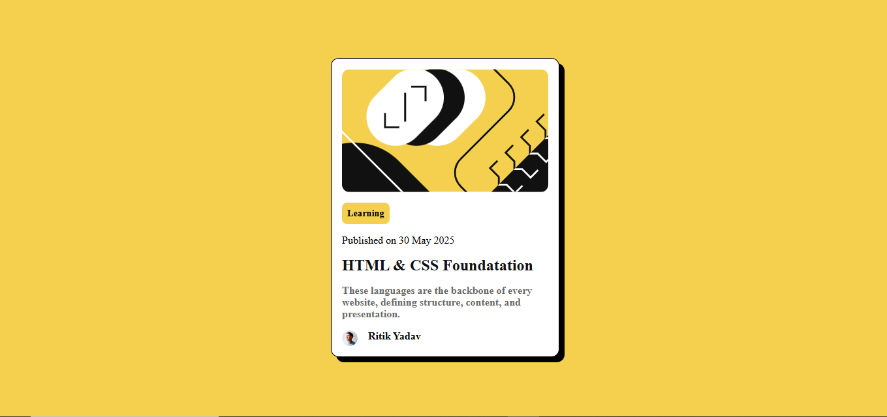

# Frontend Mentor - Blog Preview Card Solution

This is my solution to the [Blog Preview Card challenge on Frontend Mentor](https://www.frontendmentor.io/challenges/blog-preview-card-ckPaj01IcS). These challenges help you improve your front-end skills by building real-world projects.

## Table of Contents

- [Overview](#overview)
  - [The Challenge](#the-challenge)
  - [Screenshot](#screenshot)
  - [Links](#links)
- [My Process](#my-process)
  - [Built With](#built-with)
  - [What I Learned](#what-i-learned)
  - [Continued Development](#continued-development)
  - [Useful Resources](#useful-resources)
- [Author](#author)
- [Acknowledgments](#acknowledgments)

## Overview

A fully responsive blog card component built as part of a Frontend Mentor challenge.

### The Challenge

Users should be able to:

- View the component on different screen sizes (responsive design)
- See hover and focus states for all interactive elements

### Screenshot



### Links

- [Solution on Frontend Mentor](https://theritikyadav11/Blog-Card/)
- [Live Site](https://theritikyadav11/Blog-Card/)

## My Process

### Built With

- Semantic HTML5
- CSS Custom Properties
- Flexbox
- Mobile-First Workflow

### What I learned

While developing this project I learned how to style an inline element
we cannot specify space and margin to inline element but we can use this by using some tips like
change the element behaviour to inline-block so that it can work like a block element in terms of spacing and margin.

To see how you can add code snippets, see below:

```html
<span>Learning</span>
```

```css
span {
  display: inline-block;
  background-color: hsl(47, 88%, 63%);
  color: black;
  padding: 0.5rem;
  border-radius: 8px;
  font-weight: bold;
  font-size: 0.9rem;
  width: fit-content;
}
```

### Continued development

Since I have developed this project as fully responsive. In future I want to implement this component with my major projects.

### Useful resources

- [MDN](https://developer.mozilla.org/en-US/) - This helped me for solving the styling of inline element.
- [Code Help](https://www.codehelp.in/tutorial/html-2/semantic-html) - This is an amazing article which helped me finally understand about semantic elements. I'd recommend it to anyone still learning this concept.

## Author

- Website - [Arvind kumar](https://www.your-site.com)
- Frontend Mentor - [@theritikyadav11](https://www.frontendmentor.io/profile/theritikyadav11)
- LinkedIn - [@Arvind kumar](https://www.linkedin.com/in/arvind-kumar123/)

## Acknowledgments

Thanks to the Frontend Mentor community and documentation sources like MDN and CodeHelp for guiding me through the process. Your support and content have helped me enhance my skills and build a better understanding of HTML and CSS.
